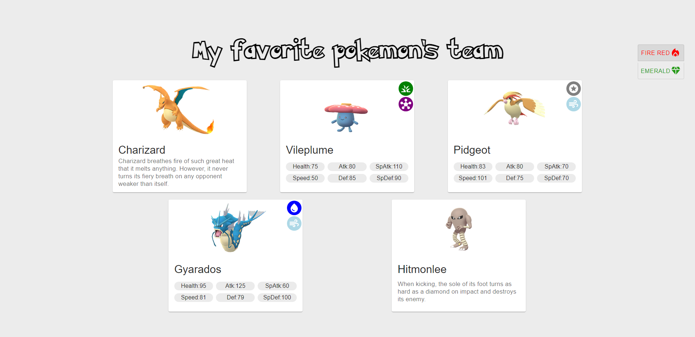

# Pokemon-Teams

## Overview

### This project is about my favorite team's for some pokemon games, that are the best to finish the game, using good combinations of strong pokemons from several different pokemon types. 

### Each team features a different set of pokemons that you can use in the specified pokemon game, you can look at their types, stats, description, etc... To toggle the pokemon's data type (basic/advanced) you simply need to click on the pokemon card.  

---

**Live demo:** [pokemon-teams](http://afektheminilearner.github.io/pokemon-teams)

**Installation:** 
_`npm install`_

**Running the project:** 
_`npm run start`_

---

### **Example of using the project:**

---

### **Technology**

### This project has been developed using ReactJS, JavaScript, Mui v5, styled-components, ESLINT. It is also adapted to fit smaller screens using media queries. 

---

## Author

:octocat: **Afek Sakaju**

- LinkedIn: [@afeksa](https://www.linkedin.com/in/afeksa/)
- GitHub: [@afekTheMiniLearner](https://github.com/afekTheMiniLearner)
